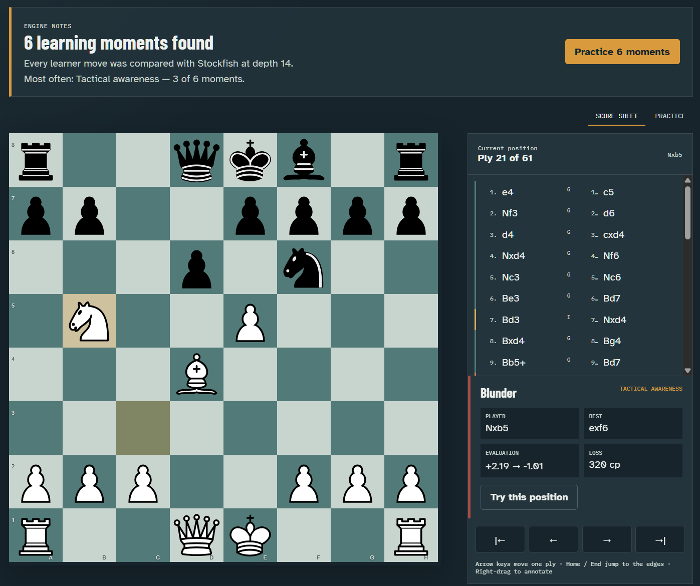

# LealChess

LealChess is a chess training desk for playing Stockfish, studying your own games, and
practicing the decisions that cost you the most.



## What you can do

- Play full games against Stockfish with premoves, promotion, annotations, sounds, and saved state.
- Import recent Chess.com and Lichess games with speed and game-count filters.
- Review every move on a flippable board with keyboard replay controls.
- Run cancellable local Stockfish analysis and resume it later without losing completed work.
- Turn inaccuracies, mistakes, and blunders into focused practice positions.
- Find recurring opening, tactical, positional, and endgame priorities across analyzed games.

## Local-first by design

Stockfish runs in a browser worker on your device. LealChess contacts the public Chess.com or Lichess
API only when you ask it to import games; imported profiles, games, analysis results, preferences,
and active play are stored in browser IndexedDB. There is no LealChess account or cloud database.

Unavailable services do not erase saved games. Imports report each platform independently and
explain how to recover from invalid usernames, private games, rate limits, malformed exports, or
connectivity failures.

## Roadmap

LealChess is growing as a training tool, with no fixed delivery dates:

- Richer explanations for why a move lost time, material, safety, or positional value.
- Opening and endgame drills generated from recurring positions in imported games.
- More import sources and finer controls for choosing the games that enter the study ledger.
- More personalized practice plans built from patterns across completed reviews.

## Development

Requirements:

- Node.js 22.22.3+ or 24.15.0+
- pnpm 11.17.0, pinned in `package.json`

Install and run the application:

```sh
pnpm install
pnpm start
```

The development server is available at <http://localhost:4200>.

Run the full quality suite:

```sh
pnpm format:check
pnpm lint
pnpm typecheck
pnpm test:coverage
pnpm build
pnpm e2e
```

## Built with

- [Angular](https://angular.dev/) for the application shell and reactive UI
- [Chessground](https://github.com/lichess-org/chessground) for board rendering and interaction
- [chess.js](https://github.com/jhlywa/chess.js) for authoritative chess rules and PGN handling
- [Stockfish.js](https://github.com/nmrugg/stockfish.js) for local play and analysis
- [IndexedDB](https://developer.mozilla.org/docs/Web/API/IndexedDB_API) for local persistence
- [Vitest](https://vitest.dev/) and [Playwright](https://playwright.dev/) for automated confidence

## License

LealChess is licensed under GPL-3.0. See [LICENSE](LICENSE) and
[third-party notices](docs/THIRD_PARTY_NOTICES.md).
